<div align="center">



</div>

<div align="center">

[](https://www.linkedin.com/in/anv-dev/)&nbsp;&nbsp;[](https://www.instagram.com/anv.vibes/)&nbsp;&nbsp;[](mailto:dasanuvab38@gmail.com)&nbsp;&nbsp;[](https://github.com/Stewy8506)

</div>

<br/>

<div align="center">
<table width="100%"><tr>
<td width="50%" valign="top">

```yaml
# anuvab.config.yaml [v4.0]
name: "Anuvab Das"
role: "Full-Stack & Embedded Systems Developer"
focus:
  hardware:
    - MCU: ["ESP32", "ESP32-S3", "STM32F401"]
    - Protocols: ["BLE", "I2S", "I2C", "DMA"]
    - CAD: ["KiCad", "Custom PCB Design"]
  systems:
    - Languages: ["Rust", "C/C++", "Python"]
    - Engine: ["Tauri v2", "oxc-parser", "Tree-Sitter"]
  software:
    - Frontend: ["React 19", "Next.js", "Zustand"]
    - Mobile: ["React Native", "Expo v54"]
    - Backend: ["FastAPI", "Node.js", "Firebase"]
  ai_ml:
    - Orchestration: ["Gemini API", "Local RAG"]
    - Vision: ["YOLOv8 Computer Vision"]
```

</td>
<td width="50%" valign="top">

```text
$ system_diagnostics --skills

[EMBEDDED / DSP ] ████████████████████ 92%
  ↳ STM32 DMA buffer loops, I2S DAC mixing
  ↳ Sensor fusion, autonomous crash alert
[FULL-STACK AI  ] ████████████████░░░░ 80%
  ↳ Custom agentic tool routing
  ↳ Multi-LLM load balancing & cost logs
[SYSTEMS / RUST ] ██████████████░░░░░░ 70%
  ↳ Native Tauri IPC & oxc-parser bindings
  ↳ Real-time spatial AST visualisations
[MOBILE / STATE ] ████████████░░░░░░░░ 60%
  ↳ Custom native Expo alarms & modules
  ↳ Real-time Firestore synchronization

Uptime: [LIVE]
All systems operational.
```

</td>
</tr></table>
</div>

<br/>

<div align="center">



</div>

<br/>

<div align="center">



</div>

<br/>

<div align="center">



</div>

<br/>

<div align="center">


&nbsp;&nbsp;

</div>

<br/>

<div align="center">


</div>

<br/>

<div align="center">


</div>

<br/>

<div align="center">


</div>
